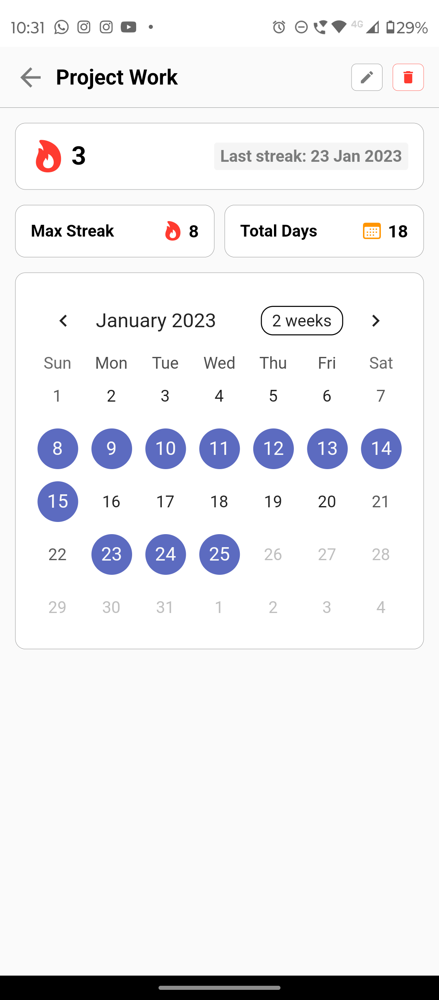

<h1 align="center" id="title">habit.ed - Habit Tracker App</h1>

- `habit.ed` is a simple app for tracking daily habits built with Flutter and Google OAuth.
- apk link: [habited.apk](./assets/post-build/habited.apk)
- web-app link: https://habit-ed.firebaseapp.com/

---

### Project Screenshots

<div style="width:100%;height:400px;display:flex; flex-direction:row; gap: 20px; justify-content:space-around">
    
    
    
</div>
<div style="width:100%;height:400px; display:flex; flex-direction:row; gap: 20px; justify-content:space-around">
    
    
</div>


---  
  
### 🧐 Features
- Integrated with Google Authentication
- Add new habits to track
- Mark habits as complete for the day
- View progress for each habit over time
- Set reminders for habits

---

### 🛠️ Installation Steps
```sh
# flutter version : 2.10.2
# dart version : 2.16.1
git clone https://github.com/mannnish/habit.ed
flutter pub get
flutter run
```

---


### 💻 Technologies Used
- runtime/ framework: Flutter
- dependencies: firebase_auth, cloud_firestore, shared_preferences, etc.
- third-party: Firebase